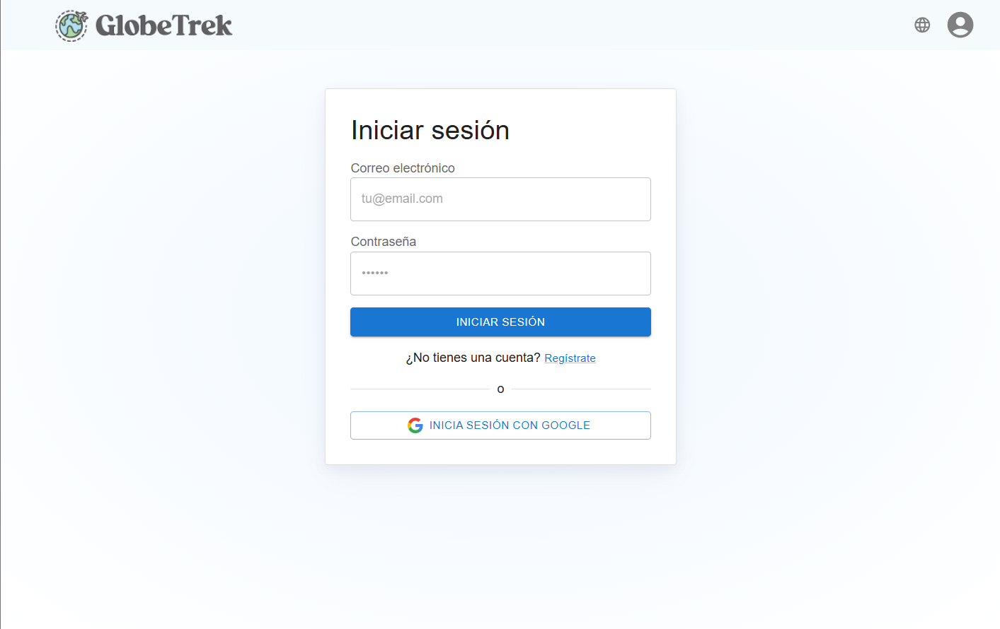
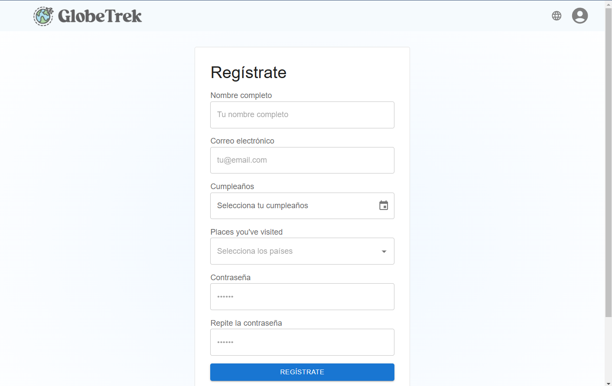
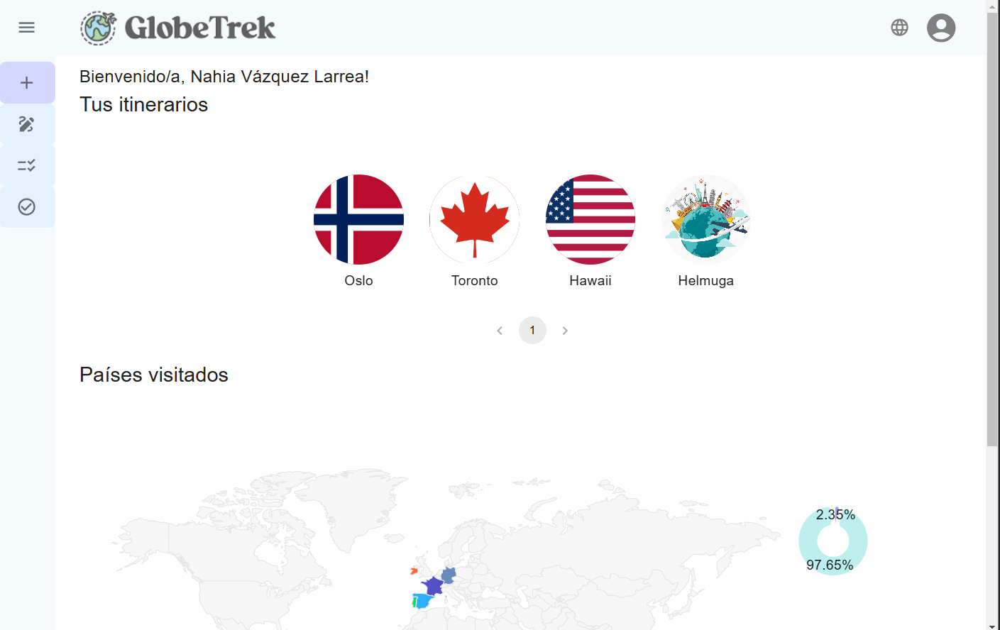
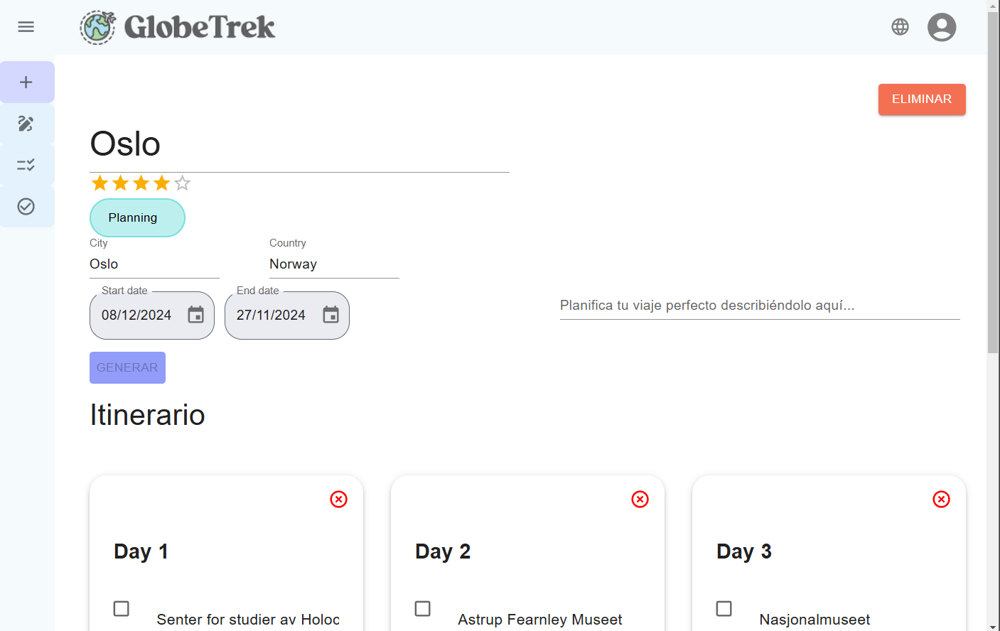

## Índice
1. [Requisitos previos](#requisitos-previos)
2. [Microservicios](#microservicios)
   - [Microservicio de gestión de usuarios](#microservicio-de-gestión-de-usuarios)
   - [Microservicio de gestión de itinerarios](#microservicio-de-gestión-de-itinerarios)
   - [Microservicio de gestión de destinos](#microservicio-de-gestión-de-destinos)
3. [Gateway](#gateway)
4. [Interfaz de usuario](#interfaz-de-usuario)
5. [Ejecución](#ejecución)

---

## Requisitos previos

Antes de ejecutar la aplicación, asegúrate de tener instalados los siguientes servicios y herramientas:

- **Servidor de MongoDB**: [Descargar MongoDB](https://www.mongodb.com/try/download/community-kubernetes-operator)
- **PostgreSQL**: [Descargar PostgreSQL](https://www.postgresql.org/download/)
- **Docker** (opcional para usar contenedores): [Descargar Docker](https://www.docker.com/)
- **Ollama** (para la creación de itinerarios personalizados): [Descargar Ollama](https://ollama.com/download)
- **Python**: [Descargar Python](https://www.python.org/downloads/)
- **NodeJS**: [Descargar Node.js](https://nodejs.org/)

También se deben modificar los archivos .env.

---

## Microservicios

La aplicación está compuesta por varios microservicios que gestionan distintas funcionalidades. A continuación se detalla cada uno de ellos:

### Microservicio de gestión de usuarios

Este microservicio se encarga de la gestión de los usuarios, permitiendo la creación, modificación, eliminación y autenticación. Utiliza **PostgreSQL** para almacenar la información y **FastAPI** para crear la API RESTful.

### Microservicio de gestión de itinerarios

Gestiona la lógica para crear, modificar y eliminar itinerarios. Además, permite la creación de itinerarios personalizados usando **Ollama**. Los itinerarios se almacenan en **MongoDB**.

### Microservicio de gestión de destinos

Permite la creación y eliminación de destinos, además de mostrar información de los mismos. Al igual que el microservicio de itinerarios, utiliza **MongoDB** para el almacenamiento.

---

## Gateway

El **Gateway** es el punto central que enruta las solicitudes hacia los microservicios correspondientes y devuelve las respuestas adecuadas al usuario. Es una capa que simplifica las interacciones con los microservicios.

---

## Interfaz de usuario

La **Interfaz de Usuario** es visual e interactiva, permitiendo a los usuarios gestionar sus itinerarios, destinos y perfiles. Algunas de sus funcionalidades son:

- **Visualización de destinos**: Muestra un mapa con los destinos visitados y un gráfico con el porcentaje de países visitados.
- **Gestión de itinerarios**: Los usuarios pueden ver y gestionar sus itinerarios planificados y realizados.
- **Multilingüismo**: La interfaz soporta múltiples idiomas.

### Capturas de Pantalla

- **Inicio de sesión**

- **Registro**

- **Página principal**

- **Itinerario**

---

## Ejecución

### Pasos para la ejecución

A continuación se detallan los pasos para ejecutar la parte servidora y la parte cliente de la aplicación.

#### 1. Ejecutar los microservicios (Backend)

1. **Microservicio de gestión de usuarios**:
   - Dirígete al directorio del microservicio de usuarios y ejecuta los siguientes comandos:

     ```bash
     cd backend
     pip install -r requirements.txt
     uvicorn main:app --host 0.0.0.0 --port 8000
     ```

2. **Microservicio de gestión de itinerarios y destinos**:
   - Dirígete al directorio correspondiente y ejecuta:

     ```bash
     cd nodeAPI
     npm install
     npm start
     ```

3. **Iniciar el Gateway**:
   - Navega al directorio del gateway y ejecuta:

     ```bash
     cd gateway
     uvicorn main:app --host 0.0.0.0 --port 8888
     ```

#### 2. Ejecutar la Interfaz de Usuario (Frontend)

1. Navega al directorio de la interfaz de usuario:

   ```bash
   cd globetrek
   yarn install
   yarn start
   ```

#### 3. Instalación y uso de Ollama para itinerarios personalizados

Para usar los itinerarios personalizados, es necesario instalar el modelo **Mistral**:

```bash
ollama run mistral
```

### 3. Acceso a los endpoints

Una vez los microservicios estén en ejecución, podrás acceder a los siguientes enlaces para interactuar con los endpoints de cada servicio:

- **Microservicio de gestión de usuarios**: [http://localhost:8000/docs](http://localhost:8000/docs)
- **Microservicio de gestión de itinerarios y destinos**: [http://localhost:8080/api-docs/](http://localhost:8080/api-docs/)
- **Gateway**: [http://localhost:8888/docs](http://localhost:8888/docs)

#### 4. Uso de Docker (opcional)

Si prefieres ejecutar todos los servicios mediante contenedores Docker, sigue estos pasos:

1. Dirígete a la raíz del proyecto y ejecuta el siguiente comando para iniciar todos los servicios con Docker Compose:

   ```bash
   docker-compose up
   ```

Este comando ejecutará todos los microservicios y el gateway dentro de contenedores Docker. Asegúrate de tener Docker y Docker Compose instalados.
